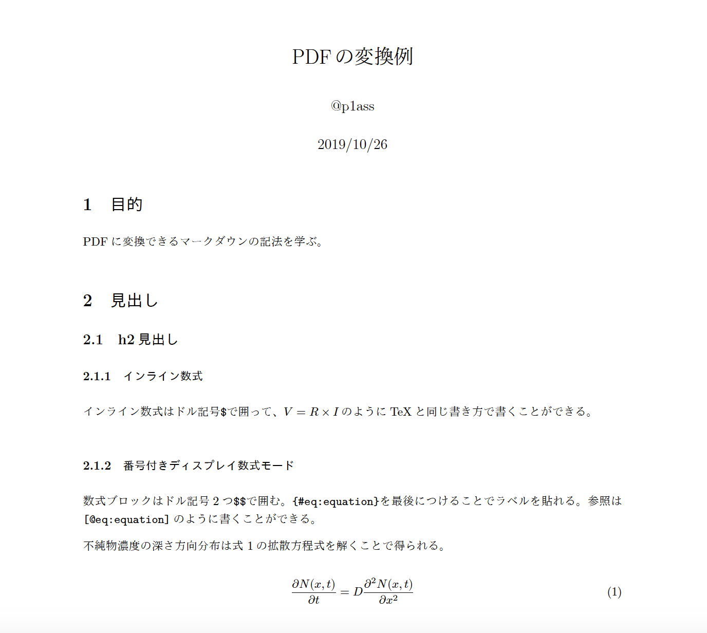

# mdtopdf 🐳

mdtopdf is the pandoc docker image for converting markdown to PDF using TeX typesetting.

## Examples

You can see example markdown file and converted PDF file from the link below👇

[example markdown](examples/example.md)

[example converted PDF](examples/example.pdf)



## Getting Started

1. Pull docker image.

```bash
$ docker pull plass/mdtopdf
```

⚠️ This docker image size is **1.68GB**. I recommend pulling it using the fast Internet connection.

2. Generate PDF file.

```bash
$ docker run -it --rm -v `pwd`:/workdir plass/mdtopdf mdtopdf INPUT.md
```

**Windows (PowerShell)** : Replace `` `pwd` `` to `${pwd}`


## Advanced Usages

### Generate 2 columns PDF file

```bash
$ docker run -it --rm -v `pwd`:/workdir  plass/mdtopdf mdtopdf-2cols INPUT.md
```

### Generate PDF file on save

```bash
$ docker run -it --rm -v `pwd`:/workdir  plass/mdtopdf w-mdtopdf INPUT.md
```

### Generate 2 columns PDF file on save

```bash
$ docker run -it --rm -v `pwd`:/workdir  plass/mdtopdf w-mdtopdf-2cols INPUT.md
```

### Set alias

You can decrease typing using `alias` command as below,

```bash
$ echo "alias mdtopdf='docker run -it --rm -v `pwd`:/workdir plass/mdtopdf mdtopdf'" >> ~/.bash_profile
$ echo "alias mdtopdf-2cols='docker run -it --rm -v `pwd`:/workdir  plass/mdtopdf  mdtopdf-2cols'" >> ~/.bash_profile
$ echo "alias w-mdtopdf='docker run -it --rm -v `pwd`:/workdir  plass/mdtopdf  w-mdtopdf'" >> ~/.bash_profile
$ echo "alias w-mdtopdf-2cols='docker run -it --rm -v `pwd`:/workdir  plass/mdtopdf  w-mdtopdf-2cols'" >> ~/.bash_profile
$ source ~/.bash_profile

$ mdtopdf INPUT.md
$ mdtopdf-2cols INPUT.md
$ w-mdtopdf INPUT.md
$ w-mdtopdf-2cols INPUT.md
```

**zsh** : Modify `.zshrc` instead of `.bash_profile`.  
**Ubuntu** : Modify `.bashrc` instead of `.bash_profile`.

If you're using Docker for Windows, setting alias is a bit tricky.  Use following command.

```powershell
> echo 'Function mdtopdf {Param($file) docker run -it --rm -v ${pwd}:/workdir plass/mdtopdf mdtopdf $(Get-ChildItem $file -Name)}' >> $PROFILE
> echo 'Function mdtopdf {Param($file) docker run -it --rm -v ${pwd}:/workdir plass/mdtopdf w-mdtopdf $(Get-ChildItem $file -Name)}' >> $PROFILE
> . $PROFILE
> mdtopdf INPUT.md
> w-mdtopdf INPUT.md
```

### Generate tex file from markdown

```bash
$ docker run -it --rm -v `pwd`:/workdir  plass/mdtopdf mdtotex INPUT.md
$ docker run -it --rm -v `pwd`:/workdir  plass/mdtopdf mdtotex-2cols INPUT.md
```

### Generate html file from markdown

```bash
$ docker run -it --rm -v `pwd`:/workdir  plass/mdtopdf mdtohtml INPUT.md
```

[example converted HTML](examples/example.html)

### Generate docx file from markdown

```bash
$ docker run -it --rm -v `pwd`:/workdir  plass/mdtopdf mdtodocx INPUT.md
```

[example converted docx](examples/example.docx)
