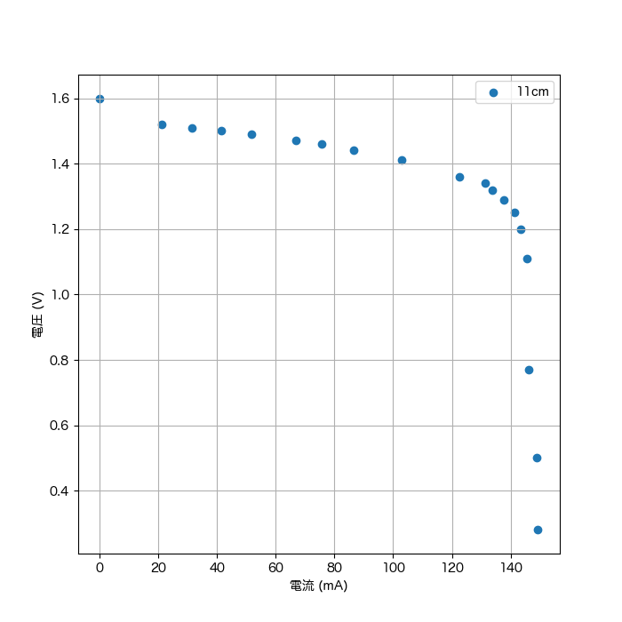

# 目的

PDFに変換できるマークダウンの記法を学ぶ。

# 見出し

## h2見出し

### インライン数式

インライン数式はドル記号`$`で囲って、 $V = R \times I$のようにTeXと同じ書き方で書くことができる。

### 番号付きディスプレイ数式モード

数式ブロックはドル記号2つ`$$`で囲む。`{#eq:equation}`を最後につけることでラベルを貼れる。
参照は`[@eq:equation]`のように書くことができる。

不純物濃度の深さ方向分布は[@eq:equation]の拡散方程式を解くことで得られる。

$$
\frac{\partial N(x,t)}{\partial t} = D \frac{\partial^2N(x,t)}{\partial x^2}
$${#eq:equation}

また、`\begin{eqnarray}`が使えるので、イコールを揃える時はこちらを使うと良い。

\begin{eqnarray}
x + y &=& 5 \label{easy_eq} \\
x &=& 2
\end{eqnarray}

式\ref{easy_eq}を解くと、$y = 3$が得られる。

# texコマンド

一度`.tex`ファイルに変換してからPDFに変換するので、texのコマンドも使用できる。
例えば、`\clearpage`を使うことで改ページができる。

改ページ前↑

\clearpage

改ページ後↓

# 画像

画像はマークダウンと同じ記法で書くことができる。文末に`{#fig:LABEL}`とすることでラベルを付与できる。`{#fig:LABEL height=100mm}`とすることで、画像の大きさも調整できる。

{#fig:solar height=100mm}


`[@fig:LABEL]`とすることで、参照を貼れる。

太陽電池の出力特性を[@fig:solar]に示す。

# 表

表のタイトル、ラベルは`:タイトル {#tbl:LABEL}`のように書くことができる。

|標本化周波数 $\mathrm{(kSa/s)}$|観測周波数 $\mathrm{(kHz)}$|
|:-:|--:|
|100|6.1|
|250|53|
|500|100|
|1000|100|

:標本化周波数を変えたときの観測周波数の変化 {#tbl:table}

表への参照を貼る時は`[@tbl:LABEL]`のように書く。

標本化周波数を変えたときの観測周波数の変化を[@tbl:table]に示す。

## セクション参照 {#sec:section}

`[@sec:LABEL]`と書くことでセクションを参照できる。

[@sec:section]によると、セクションの参照も可能である。


# 注釈

注釈[^1]

[^1]: 注釈とはほげほげ

# マークダウン記法

- 箇条書き1
    - サブ箇条書き1
    - サブ箇条書き2
- 箇条書き2
- 箇条書き3

1. 番号付きリスト1
    1. サブ番号付きリスト1
    1. サブ番号付きリスト1
1. 番号付きリスト2
1. 番号付きリスト3

**太字**


~~取り消し線~~

水平線

---

[googleへのリンク](https://google.com)


コードブロック


```c
#include <stdio.h>

int main(void) {
    printf("Hello World\n");
}
```
